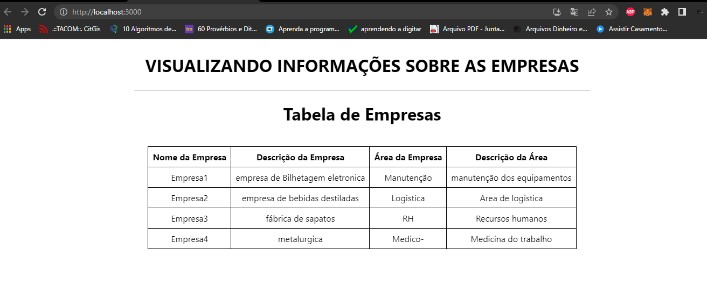

# ApiCompany
## API se comunica com banco de dados permitindo realizar diversas ações por meio de suas rotas

# Rotas:
1- /api/listEmpresas (listar as empresas)

2- /api/listAreas(listar as areas)

3- /api/areasGeral (todas as areas  por empresa)

4- /api/areaPorEmpresa (areas por empresa outro formato)

5- /api/updateEmpresa (com essa rota é possivel alterar a descrição de uma empresa)

6- /api/updateArea (permite alterar areas de uma empresa)

7- /api/novaEmpresa (permite criar uma nova empresa)

8- /api/novaArea' (permite criar uma nova area na empresa informada)

9- /api/deleteCompany (permite deletar uma empresa do banco)

10- /api/deleteArea (permite deletar uma area de determinada empresa)

## Rodando o servidor:

 * Precisa ter o Node.js instalado
 * No caso dessa API eu preferi não utilizar o express
 * o modulo http ja vem configurado no node.js
 * precisa instalar o modulo sqlite3 
 * Tambem utilizei o modulo nodemom
 
     Para efetivamente colocar o servidor para rodar, basta abrir o prompt de comando, navegar até o diretorio  raiz da sua API
 e digitar node server.js, caso esteja a utilizar o nodemon basta digitar" npm start" a API vai estar no ar e pronta para consumo.
    Logo mais acima temos uma lista de rotas que podem ser  usadas na nossa API, sendo as 4 primeiras rotas de consumo.
    foi construida uma pagina em react  que renderiza uma tabela, nela é possivel visualizar os dados que foram armazenados no banco de dados, preferi deixá-la em um repositório diferente, para evitar possiveis conflitos  e confusões o link para o repositório é [https://github.com/oscarRodriguesDev/Consurmer-API-01]

    veja como os dados aparecem na pagina na imagem abaixo:
    
    
## Arquivo Companies.db
    
Esse é o arquivo banco de dados onde as informações das empresas estão armazenadas, preferi deixá-lo pré configurado 
portanto, ele ja possui algumas empresas exemplo para que seja realizado os devidos testes.
    
Fique a vontade para conferir todas as rotas e verificar o tipo de objeto recebido, qualquer ideia para melhoria será bem vinda

## Sobre a pagina React
você pode clonar o repositorio do git no endereço [https://github.com/oscarRodriguesDev/Consurmer-API-01] a seguir  para que tudo ocorra como esperado, é preciso que você execute o comando npm install react.js
Uma vez o O react instalado em suas dependecias,você poderá inicializar pagina com o seguinte comando "npm start"  lembre-se que você deve estar no diretório raiz da sua aplicação.

Para visualizar os dados das empresas na pagina react, você deve iniciar a API a forma como isso deve ser feito foi descrita anteriormente nesse documento.

Em seguida iniciar sua pagina react

    
 